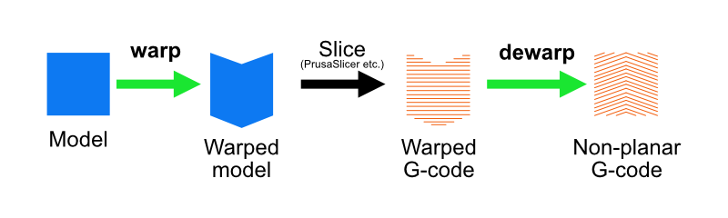
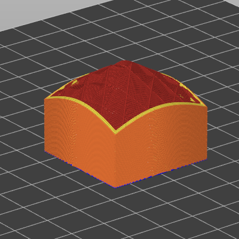
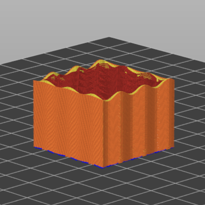

# 🐢⚗️turtly-converter
**turtly-converter** is a model preprocessor / G-code postprocessor for **non-planar 3D printing**.

## ⚠️CAUTION
This software is experimental.
**IT MAY CAUSE DAMAGE TO YOUR 3D PRINTER.**
USE AT YOUR OWN RISK.

## 💡How it works

**turtly-converter** achieves non-planar 3D printing through the following three steps:
1. Pre-warp the original 3D model. This is done using the `warp` subcommand.
2. Slice the warped 3D model in a conventional (planar) way, using an existing slicer, such as [PrusaSlicer](https://www.prusa3d.com/page/prusaslicer_424/) or [OrcaSlicer](https://orcaslicer.net/).
3. Dewarp the generated G-code to obtain the non-planar G-code. This is done using the `dewarp` subcommand.

This three-step approach, using an existing slicer, is the same as described in [the article by XYZdims](https://xyzdims.com/2021/03/03/3d-printing-90-overhangs-without-support-structure-with-non-planar-slicing-on-3-axis-printer/) and [the paper by Wüthrich et al](https://doi.org/10.3390/app11188760).

## 🚀Usage
### 🎁Installation
**turtly-converter** is a single-executable application.
You can download a `.zip` file from [the Releases page](https://github.com/tana/turtly-converter/releases) and simply get an executable in that.

### ⌨Command line interface
**turtly-converter** is a single executable with a subcommand-based interface.
There are two main subcommands:
- `warp`: Warps a model file (`*.stl`) and produces a warped model file (`*.warped.stl`), and an information file (`*.transform.json`).
- `dewarp`: Dewarps a G-code file and produces a non-planar G-code file (`*.dewarped.gcode`). It requires both a warped G-code file (`*.gcode`) and an information file (`*.transform.json`).

The typical use case looks like this:
1.  Run `turtly-converter warp model.stl` to generate `model.warped.stl` and `model.transform.json`.
2. Slice `model.warped.stl` using an existing slicer and save G-code as `model.warped.gcode`.
3. Run `turtly-converter dewarp model.warped.gcode model.transform.json` to generate `model.warped.dewarped.gcode`.
4. Send `model.warped.dewarped.gcode` to your 3D printer.

### 🍕Slicer configuration
The slicer used to slice the warped G-code must be configured as follows:
- `BEGIN_DEWARP X{print_bed_size[0]} Y{print_bed_size[1]}` (in case of Prusa or OrcaSlicer) command at the end of the printer-specific Start G-code.
- `END_DEWARP` command at the beginning of the printer-specific End G-code.
- Absolute E (extrusion distance) must be used.
- Supports, brims and any similar structures must be disabled.

The rest of the settings can be the same as usual.

### ⚗️Transformation types
Transformation type is specified by the `--type` or `-t` option of `warp` subcommand.

#### 🔺Conical (`-t conical`)

In this transformation, the object is sliced by either an upward or downward facing cone.
When the slope angle (`--slope-angle` or `-s`) is positive, an upward facing cone is used.
When negative, a downward facing cone is used.

This type of slicing is useful to print steep overhangs without supports, as described in [the XYZdims article](https://xyzdims.com/2021/03/03/3d-printing-90-overhangs-without-support-structure-with-non-planar-slicing-on-3-axis-printer/) and [Wüthrich et al. 2021](https://doi.org/10.3390/app11188760).

#### 〰️Sinusoidal (`-t sinusoidal`)

In this transformation, the slices are in the form of $\sin x \cos y$.
The pitch (`--pitch` or `-p`) and the peak-to-peak height (`--height` or `-h`) are configurable.

This type of slicing is inspired by [the paper by Allum et al.](https://doi.org/10.1016/j.addma.2020.101715) and can (probably) be used to improve mechanical properties.

## 📚References
- [3D Printing: 90° Overhangs without Support Structure with Non-Planar Slicing on 3-axis Printer](https://xyzdims.com/2021/03/03/3d-printing-90-overhangs-without-support-structure-with-non-planar-slicing-on-3-axis-printer/): An article which proposed the "warp, slice and dewarp" process.
- [Slicer4RTN](https://github.com/Spiritdude/Slicer4RTN) by [XYZdims](https://xyzdims.com/): The program implementing the aforementioned approach.
- [Wüthrich et al., “A novel slicing strategy to print overhangs without support material,” Appl. Sci. (Basel), vol. 11, no. 18, p. 8760, Sep. 2021.](https://doi.org/10.3390/app11188760): A research paper that uses the same approach, but for 4-axis printers.
- [Allum et al., “ZigZagZ: Improving mechanical performance in extrusion additive manufacturing by nonplanar toolpaths,” Addit. Manuf., vol. 38, no. 101715, p. 101715, Feb. 2021.](https://doi.org/10.1016/j.addma.2020.101715): A research paper that uses non-planar (zigzag) slicing to improve the mechanical properties of 3D printed objects.
